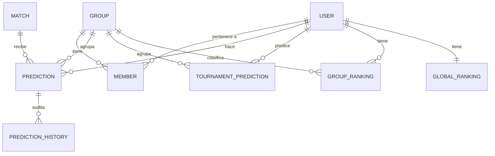

# 📐 Guía de Arquitectura de Datos y Lógica de Negocio

Esta guía detalla el diseño técnico, la estructura de la base de datos, el flujo de negocio y los procesos automáticos de **Cero a Cero**. Está pensada para desarrolladores que deseen comprender el funcionamiento interno del backend y realizar modificaciones.

---

## 💾 1. Modelo de Base de Datos (Relaciones)

El esquema de base de datos está modelado con **Prisma** (ver [`prisma/schema.prisma`](file:///c:/Users/David/Desktop/cero-a-cero/cero-a-cero/prisma/schema.prisma)) y se basa en las siguientes entidades:



### Relaciones Clave:
1. **Usuarios y Grupos (`User` $\leftrightarrow$ `Group` $\leftrightarrow$ `Member`):**
   * Un usuario puede ser creador/administrador de múltiples grupos (`adminId` en `Group`).
   * Para pertenecer a un grupo, se crea un registro en la tabla intermedia **`Member`**, la cual almacena el `nick` del usuario para ese grupo específico (permitiendo tener pseudónimos diferentes por grupo).
2. **Predicciones (`Prediction`):**
   * Una predicción une a un `User`, un `Match` y un `Group` (clave única compuesta `[userId, matchId, groupId]`).
   * Almacena los goles pronosticados para el local y visitante, el tipo de resultado calculado (HOME, DRAW, AWAY) y los puntos ganados (`pointsEarned`), que es nulo hasta que el partido finaliza y se ejecuta el recálculo.
3. **Auditoría de Cambios (`PredictionHistory`):**
   * Cada vez que se crea o modifica una predicción en el API de partidos, se inserta una fila en esta tabla registrando los goles pronosticados, la acción ("CREATE" o "UPDATE") y la fecha. Esto permite auditar comportamientos sospechosos o disputas entre amigos.
4. **Tablas de Ranking Precalculadas (`GroupRanking` y `GlobalRanking`):**
   * En lugar de sumar todas las predicciones de todos los partidos cada vez que un usuario consulta la clasificación (lo cual sería lento en base de datos), las clasificaciones se almacenan precalculadas.
   * Se actualizan automáticamente mediante tareas programadas (crons) o cuando un administrador pulsa el botón de recalcular en el panel.

---

## 🏆 2. Lógica de Puntuación (Scoring)

La lógica de cálculo reside en [`src/lib/scoring`](file:///c:/Users/David/Desktop/cero-a-cero/cero-a-cero/src/lib/scoring):

* **Cálculo Individual:** La función `calculatePredictionPoints` compara una predicción con el resultado real de un partido terminado:
  * Si los goles de ambos equipos coinciden exactamente $\rightarrow$ **4 puntos**.
  * Si se acertó la tendencia (ganó local, empataron o ganó visitante) pero no los goles exactos $\rightarrow$ **1 punto**.
  * En cualquier otro caso $\rightarrow$ **0 puntos**.
* **Proceso de Recálculo global:**
  1. Se actualizan los puntos acumulados por partido de cada predicción en la base de datos.
  2. Se recalculan los puntos de bonificación del torneo (campeón, subcampeón, etc.) contrastándolos con la tabla única `TournamentResult`.
  3. Se agrupan los puntos por usuario y grupo, se ordenan y se guardan las posiciones en `GroupRanking` y `GlobalRanking`.

---

## 🔒 3. Reglas de Negocio Críticas: Bloqueo de 3 minutos

Para garantizar el juego limpio, las predicciones no pueden cambiarse una vez que el partido está por comenzar.
* **Implementación:** En el endpoint de guardado ([`src/app/api/groups/[groupId]/matches/[matchId]/route.ts`](file:///c:/Users/David/Desktop/cero-a-cero/cero-a-cero/src/app/api/groups/[groupId]/matches/[matchId]/route.ts#L119-L125)), se calcula el límite de tiempo restando 3 minutos a la fecha del partido:
  ```typescript
  const now = new Date();
  const lockTime = new Date(match.date.getTime() - 3 * 60 * 1000);
  if (now >= lockTime) {
    return jsonError("Predicciones bloqueadas...", 400);
  }
  ```
* **Privacidad de Predicciones:** Para evitar que un usuario copie la predicción de otro, las predicciones de los miembros del grupo no son visibles en el endpoint `GET` de partidos hasta que se cruza el umbral de los 3 minutos antes del inicio del encuentro.

---

## 🔄 4. Sincronización en Vivo de Resultados

El backend se conecta con la API externa de **football-data.org** para automatizar el ciclo de vida de los partidos:

1. **Planificador en Segundo Plano:**
   * En [`src/lib/football-data/sync.ts`](file:///c:/Users/David/Desktop/cero-a-cero/cero-a-cero/src/lib/football-data/sync.ts), se encuentra `startLiveMatchesScheduler()`.
   * Si hay partidos marcados en estado `LIVE` o programados para hoy, se inicia un bucle que consulta la API externa cada ciertos minutos para actualizar los goles, el minuto de juego y el estado (LIVE, FINISHED).
2. **Actualización Automática:**
   * Cuando un partido pasa a estado `FINISHED` (finalizado), el sistema marca el partido como terminado, actualiza los goles definitivos y dispara internamente el recálculo de los rankings para que los usuarios vean reflejados sus puntos de inmediato al actualizar la pantalla.
